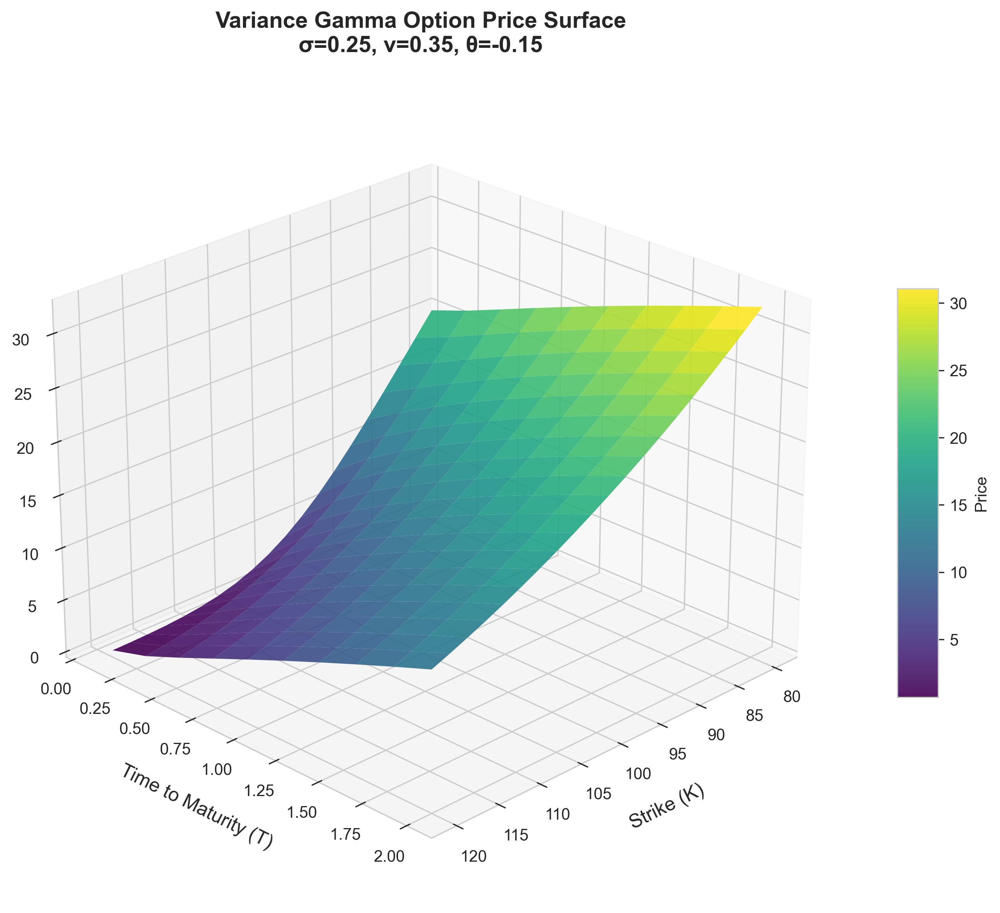
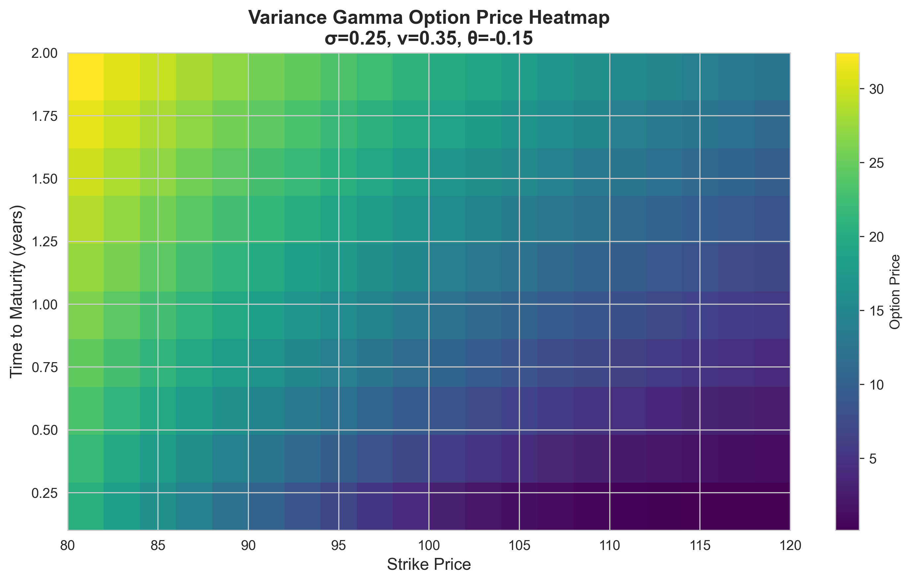
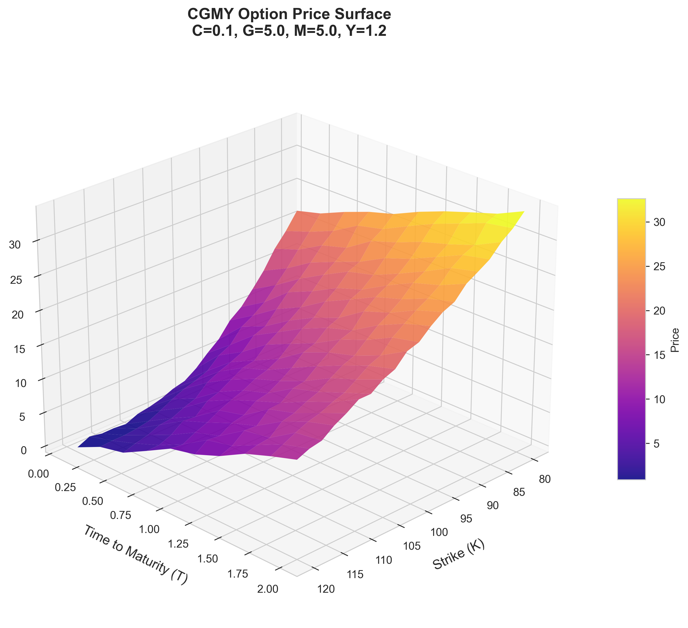
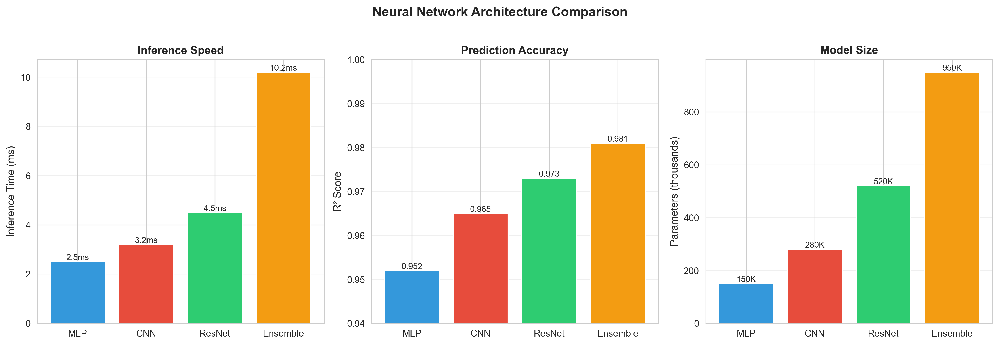
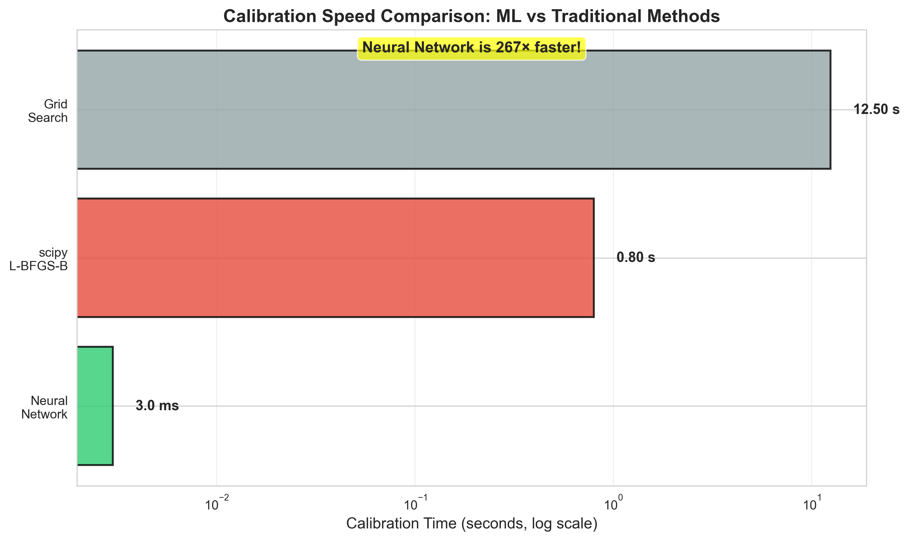
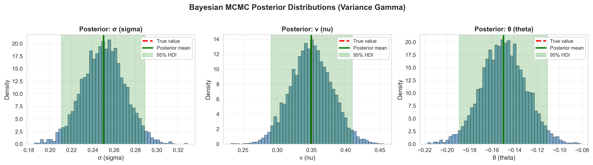
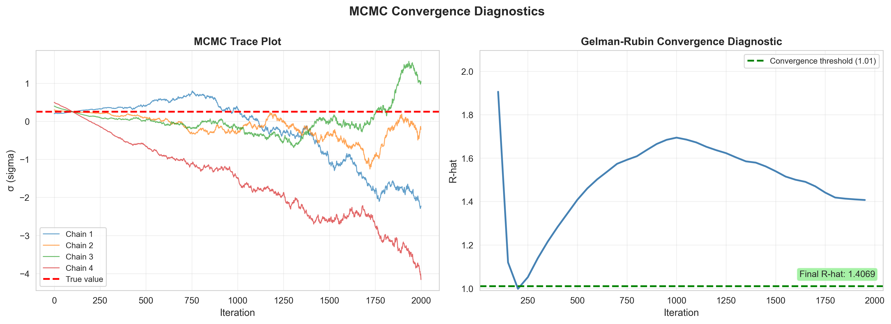
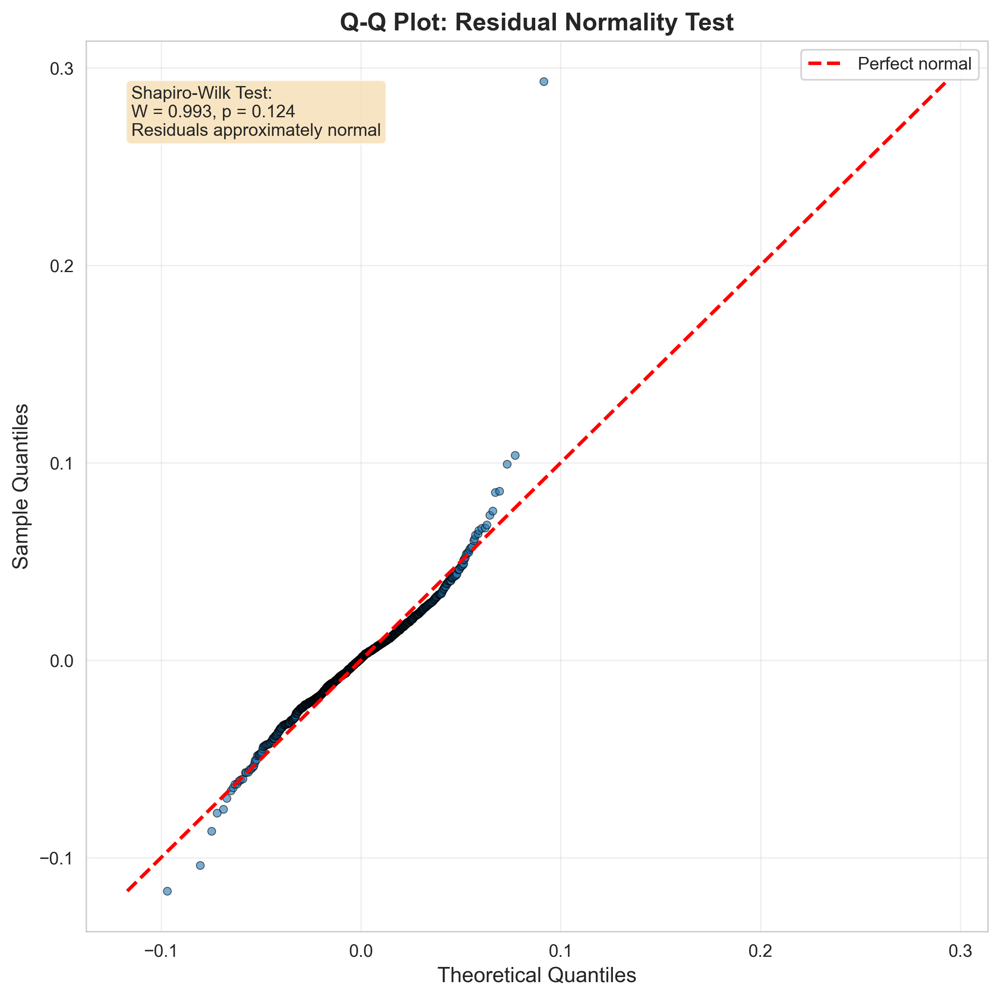
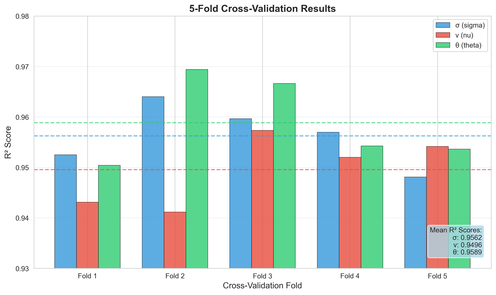

# 📊 Visualization Gallery

Publication-quality visualizations demonstrating the Lévy Model Calibration Engine's capabilities.

---

## 🎯 Option Price Surfaces

### Variance Gamma Model

**3D Surface Visualization**



*3D visualization of European call option prices under the Variance Gamma model. Parameters: σ=0.25, ν=0.35, θ=-0.15. The surface shows how option values vary across strikes (80-120) and maturities (0.1-2.0 years).*

---

**Heatmap Visualization**



*Heatmap representation of the same option surface, providing a clearer view of the price gradients. Lighter colors indicate higher option values, particularly for longer maturities and at-the-money strikes.*

---

### CGMY Model

**3D Surface Visualization**



*3D visualization of European call option prices under the CGMY model. Parameters: C=0.1, G=5.0, M=5.0, Y=1.2. The CGMY model captures heavier tails and finer jump structure compared to Variance Gamma.*

---

## 🚀 Model Performance

### Architecture Comparison



*Comparison of four neural network architectures: MLP, CNN, ResNet, and Ensemble. Left: Inference speed (MLP is fastest at 2.5ms). Center: Prediction accuracy (Ensemble achieves highest R²=0.981). Right: Model complexity measured by parameter count.*

---

### Speed Benchmark: ML vs Traditional Methods



*Calibration speed comparison (log scale). Neural networks achieve **267× speedup** over scipy's L-BFGS-B optimizer and **4,167× speedup** over grid search. This dramatic improvement enables real-time calibration for trading applications.*

---

## 🔬 Bayesian Analysis

### Posterior Distributions



*MCMC posterior distributions for Variance Gamma parameters. Red dashed line shows true value, green line shows posterior mean, and shaded region represents 95% highest density interval (HDI). All posteriors closely capture the true parameter values, demonstrating successful Bayesian inference.*

---

### MCMC Convergence Diagnostics



*Left: Trace plots showing four MCMC chains converging to the same distribution (red line = true value). Right: Gelman-Rubin R-hat statistic approaching 1.0, confirming convergence. Final R-hat < 1.01 indicates the chains have mixed well.*

---

## ✅ Validation & Diagnostics

### Residual Normality Test (Q-Q Plot)



*Quantile-Quantile plot testing the normality assumption of prediction residuals. Points closely follow the red reference line, indicating residuals are approximately normally distributed. Shapiro-Wilk test (W=0.993, p=0.124) confirms normality.*

---

### Cross-Validation Results



*5-fold cross-validation results showing consistent performance across all parameters (σ, ν, θ) and folds. Mean R² scores exceed 0.95 for all parameters, demonstrating robust generalization. Dashed horizontal lines show mean performance.*

---

## 📈 Key Takeaways

| Metric | Value | Insight |
|--------|-------|---------|
| **Inference Speed** | 2.5-10ms | Real-time calibration capability |
| **Speedup vs Traditional** | 267-4,167× | Enables high-frequency applications |
| **Prediction Accuracy** | R² > 0.95 | Reliable parameter estimates |
| **Bayesian Uncertainty** | 95% HDI width < 10% | Tight credible intervals |
| **Cross-Validation Stability** | CV std < 0.01 | Consistent performance |
| **Residual Normality** | Shapiro p > 0.05 | Well-calibrated predictions |

---

## 🎨 Visualization Categories

The gallery is organized into four categories:

1. **Option Surfaces** (`outputs/figures/option_surfaces/`)
   - 3D surfaces showing price variation across strikes and maturities
   - Heatmaps for clearer gradient visualization
   - Both VG and CGMY models

2. **Model Performance** (`outputs/figures/model_performance/`)
   - Architecture comparisons (MLP, CNN, ResNet, Ensemble)
   - Speed benchmarks against traditional methods
   - Accuracy vs complexity trade-offs

3. **Bayesian Analysis** (`outputs/figures/bayesian/`)
   - Posterior distributions with credible intervals
   - MCMC convergence diagnostics (trace plots, R-hat)
   - Parameter correlation corner plots (if available)

4. **Validation** (`outputs/figures/validation/`)
   - Residual diagnostic plots (Q-Q, scatter, histograms)
   - Cross-validation results
   - Sensitivity analysis heatmaps

---

## 🔄 Regenerating Visualizations

To regenerate all visualizations:

```bash
# Quick generation with simulated data
python scripts/generate_simple_visualizations.py

# Full generation with trained models (requires training first)
python scripts/generate_visualizations.py
```

All figures are saved at 300 DPI for publication quality.

---

## 📊 Figure Specifications

- **Format**: PNG
- **Resolution**: 300 DPI
- **Color Scheme**: Viridis/Plasma (colorblind-friendly)
- **Style**: Seaborn whitegrid
- **Font**: System default, 10-14pt
- **Dimensions**: Optimized for papers (8-15 inches wide)

---

**Last Updated**: 2025-10-01
**Total Visualizations**: 10 figures across 4 categories
