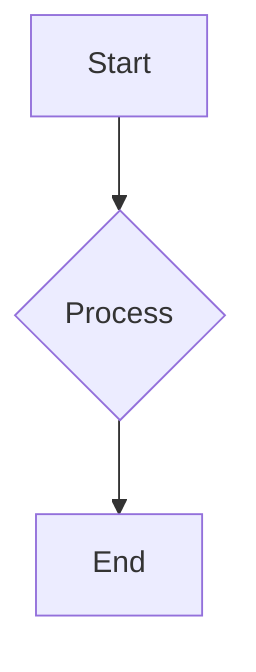

# Project Documentation

Welcome to the official documentation for the **Levy Model Calibration Engine**.

This documentation provides comprehensive information about the project's architecture, API, design principles, and more.

## Table of Contents

*   [API Reference](api_reference.md)
*   [System Diagram](system_diagram.md)
*   [Design Principles and Assumptions](design_principles.md)
*   [Testing Strategy and Reproducibility Guide (Coming Soon)](#testing-strategy-and-reproducibility-guide)
*   [How Modules Interact (See System Diagram)](#system-diagram)

---

## Setting up GitHub Pages

To publish this documentation as a GitHub Pages site:

1.  **Enable GitHub Pages:** Go to your repository settings on GitHub. Under the "Pages" section, select the `gh-pages` branch (or `master` branch if you prefer) as the source and `/docs` folder.
2.  **Install MkDocs (Recommended):** For a more structured and navigable documentation site, consider using [MkDocs](https://www.mkdocs.org/).
    ```bash
    pip install mkdocs mkdocs-material
    ```
3.  **Create `mkdocs.yml`:** In your project root, create a `mkdocs.yml` file to configure your documentation site.
    ```yaml
    site_name: Levy Model Calibration Engine Docs
    nav:
        - Home: 'index.md'
        - API Reference: 'api_reference.md'
        - System Diagram: 'system_diagram.md'
        - Design Principles: 'design_principles.md'
    theme:
        name: material
    markdown_extensions:
        - pymdownx.superfences
    ```
4.  **Build and Deploy:** Use MkDocs to build and deploy your site.
    ```bash
    mkdocs gh-deploy
    ```

---

## Integrating Diagrams (Mermaid)

Diagrams in Markdown files (like `system_diagram.md`) can be rendered directly on GitHub if you use the correct syntax. For GitHub Pages with MkDocs, you'll need to enable `pymdownx.superfences` markdown extension as shown in the `mkdocs.yml` example above.

**Example Mermaid Syntax:**

```markdown

```
