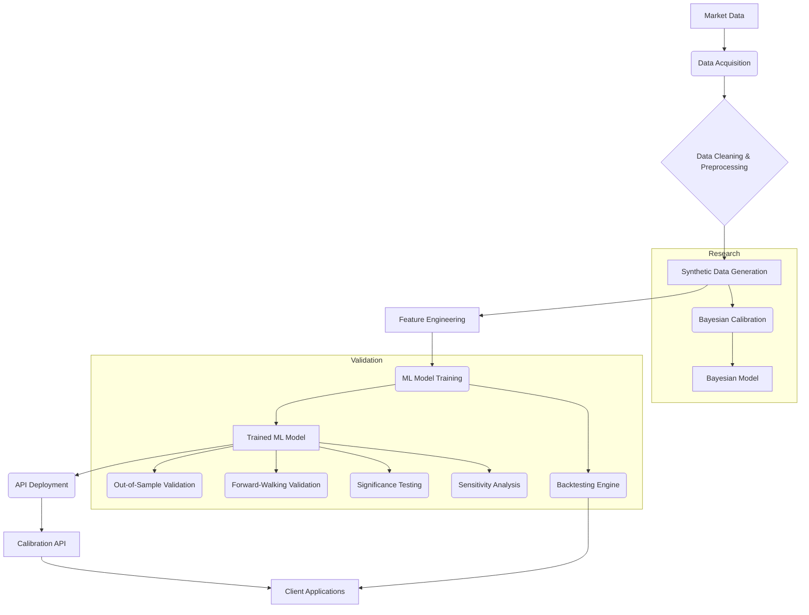

# System Diagram

This document provides an overview of the system architecture and how different modules interact.

## High-Level Architecture

## Module Interactions

### Data Flow

1.  **Market Data** is acquired and stored in `data/raw/`.
2.  **Data Cleaning & Preprocessing** (`data/cleaning.py`) transforms raw data into a usable format, stored in `data/processed/`.
3.  **Synthetic Data Generation** (`models/generate_dataset.py`) uses the `pricing_engine` to create a large dataset of (option surface, parameters) pairs, stored in `data/synthetic/`.
4.  **Feature Engineering** (`features/build_features.py`) extracts features and targets from the synthetic data, saving them to `data/processed/`.
5.  **ML Model Training** (`models/calibration_net/train.py`) uses the processed features and targets to train the `Trained ML Model` (`models/calibration_net/model.py`).

### API Interaction

1.  **Client Applications** send option price surfaces to the **Calibration API** (`production/api/main.py`).
2.  The **Calibration API** loads the `Trained ML Model` and `scaler_X` to predict Levy model parameters.

### Validation Process

1.  The `Trained ML Model` is evaluated using various validation scripts in `analysis/`:
    *   `out_of_sample.py`
    *   `forward_walking.py`
    *   `significance_testing.py`
    *   `sensitivity_analysis.py`
2.  The `Backtesting Engine` (`backtesting/engine.py`) uses the `Trained ML Model` (via a strategy) to simulate trading and evaluate performance.

### Research & Development

1.  **Bayesian Calibration** (`models/bayesian_calibration/mcmc.py`) explores alternative calibration methods.
